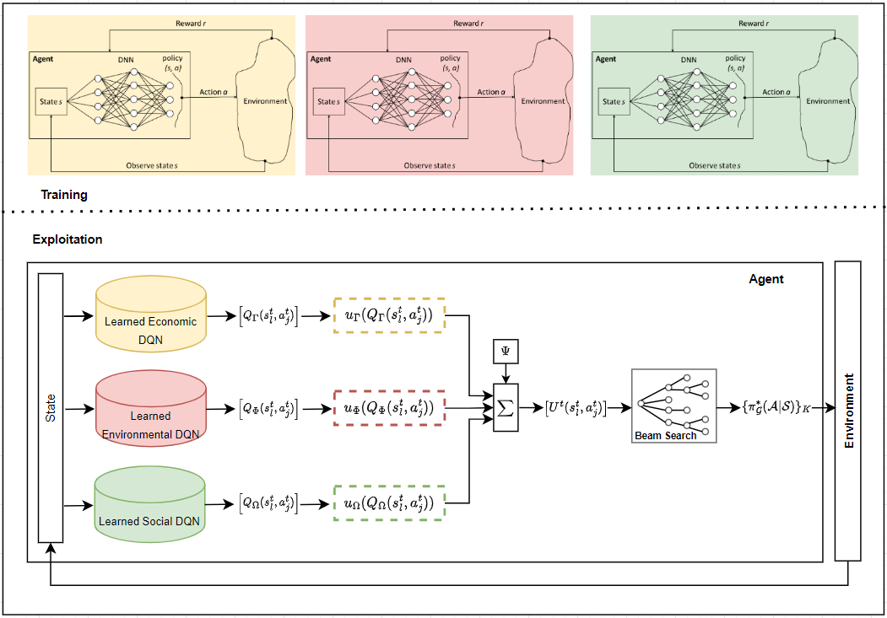

# MADRUL
This repository contains code to replicate our research described in 
"Multi-Attribute Utility Deep Reinforcement Learning
with Application to Sustainable Farming". 
## Table of contents

  * [Requirements](#requirements)
  * [Training](#training)
  * [Pre-trained Models](#pre-trianed-models)
  * [Aggregating](#aggregating)

### About 
Deep Reinforcement Learning (DRL) evolved from traditional Reinforcement Learning and Deep
Learning techniques to solve complex sequential decision-making problems. Despite the significant advances
in DRL, little attention has been paid to developing DRL algorithms to solve sequential multi-criteria decision
(SMCD) problems, which usually involve conflicting and non-commensurable attributes. Drawing from these
converging bodies of knowledge, we propose a Multi-Attribute Utility DRL (MAUDRL) algorithm to solve
SMCD. We make three significant contributions. First, we contribute to the operational research field by
integrating DRL and Multi-Criteria Decision Analysis (MCDA) methods to enable more effective decision
support for solving SMCD problems with high dimensionality. Second, we contribute to explainable analytics
and artificial intelligence (AI) by proposing a tractable and explainable MAUDRL model with multiple
sources of reward that explicitly incorporates the preferences and risk attitudes of a decision-agent. Third,
we contribute to the sustainability literature by applying MAUDRL to sustainable human resource planning
in blueberry farming in British Columbia, Canada. We study different decision-making profiles representing
farmers with varying sustainability preferences and risk attitudes. The numerical results demonstrate that
MAUDRL solves complex SMCD problems and contributes to explainable analytics and AI. We also discuss
the contribution of sustainable decision-making behaviour of the decision-agent on the quality of human
resource planning policies in blueberry farming. We discuss the implications for theory and practice.


### Requirements

* Numpy: `numpy` 
* stable baselines 3: `stable-baselines3` 
* Matplotlib" `matplotlib`
* Pytorch: `torch`
* Gym: `gym`

### Training
To train the agent for each of the objectives, the `train.py` code in the train folder needs to be executed.
You can set new paramerters for the model using the `Parameters.py` code, this includes the initial budgets, number of pruned plants, 
farm size, etc. We strongly recommend not to change the reward constant as based on our experiments 10 is the best value for it.

In addition, Hypereparametrs of the model can also be changed. This includes the learning rate, number of training steps, and exploration rate.
Based on the changes to the input parameters you may need to change the hyperparameters to achive the best 


## Pre-trianed Models
The pre-trained models can be found in the model folder. 

## Aggregating


For citation:
```angular2html
TO ADD
```
